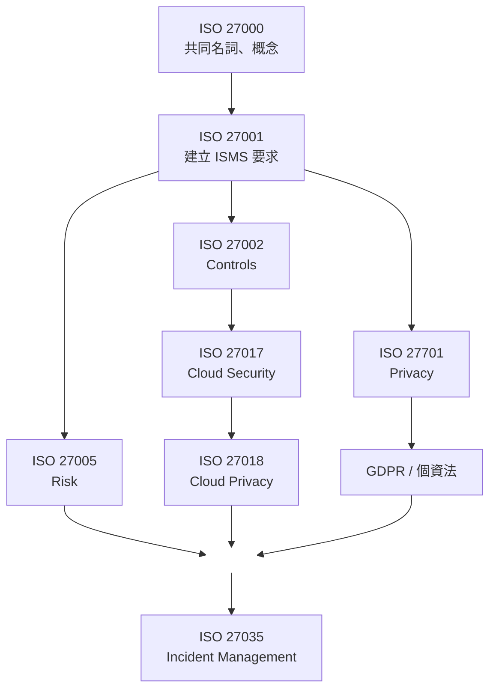

### Chapter 6 總整理  

---

**ISO 27000 Family是一系列彼此合作的國際標準，共同支援企業資訊安全管理。**  

---

**每個ISO分別代表什麼？**  

| ISO |	主要功能 |	一句話 |
|-----|---------|--------|
| 27000 |	術語與基本概念 |	大家共同的字典 |
| 27001 | ISMS Requirements |	告訴企業要做到什麼 |
| 27002 |	Security Controls |	告訴企業有哪些控制措施 |
| 27005 |	Risk Management |	告訴企業如何管理風險 |
| 27701 |	Privacy Management |	管理個人資料與隱私 |
| 27017 |	Cloud Security |	管理雲端安全 |
| 27018 |	Public Cloud Privacy |	保護公有雲中的PII |
| 27035 |	Incident Management |	管理資安事件 |

---
**ISO Family的關係**  

