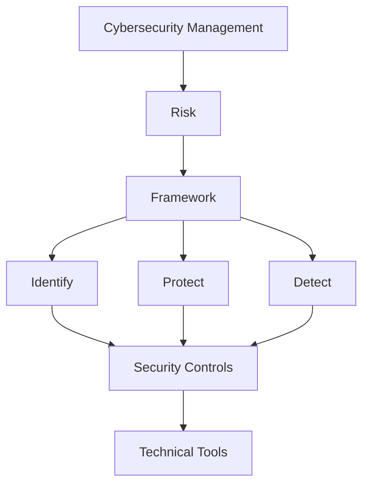

### Why we need Frameworks? (為什麼需要框架？)  

---

先看一則故事：  
今天一家公司的CISO說：「我們要提升資安」  
IT部門問：「那要先做什麼？」  
有人說：「先買EDR」  
另一個人說：「先升級Firewall」  
SOC說：「我們缺SIEM」  
HR說：「我們要先做教育訓練」。  

會發現，每個人都在做資安，但沒有一個整體方向。  

---

**Framework就是用來「整理方向」的，他會把一堆零散工作做整理、分類，再建立優先順序，最後形成完整架構。**  

---

**Framework vs Standard**  

**Standard比較強調「應該符合什麼要求」，例如ISO 27001。**  
**Framework比較強調「如何組織、規劃與改善資安工作」，例如NIST CSF。**  

---

**企業用Framework的原因**  

1.	建立共同架構：如果公司有很多個部門，每個部門都有自己的工作，Framework可以讓大家使用共同架構討論資安。  
2.	找出缺口(Gap)：經過Framework後可能會發現少了哪些部分的資安。  
3.	建立優先順序：Framework可以協助企業建立事情的優先順序。  
4.	衡量成熟度：可以讓企業知道「現在在哪裡」以及「想要到哪裡」。

---

Framework分很多種，是為了解決不同需求，後面會再講到。  

但Framework不是越多越好，越多可能會造成工作重複、文件增加、人力浪費等等。    
Framework可以互相Mapping(映射)，相同的東西企業可以把他們放在一起看，這樣就不會需要每個Framework都重新做一次了。  

---

**本節的知識圖**  

