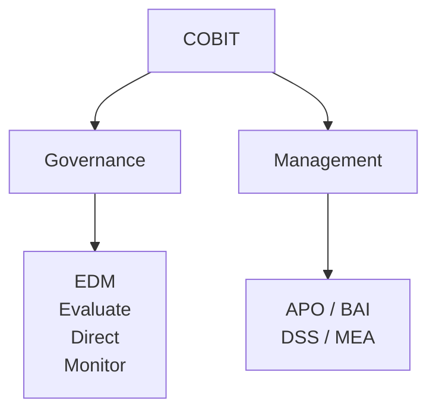

### COBIT – IT Governance Framework  

---

**COBIT(資訊及相關技術的控制目標 Control Objectives for Information and Related Technologies)** 最簡單記他就是IT Governance，由ISACA所發展，核心是「企業的IT到底有沒有支援公司的Business Goals？」  

COBIT很重視Business Goals → IT Goals → IT Management → Value，也就是IT不能為了IT而IT，而是要支援企業創造價值而存在。  

---

**COBIT解決哪些問題**  

1.	Value(價值)：IT投資到底有沒有創造價值？，例如花1億元做Mobile Banking，結果使用者增加、營收增加，客戶滿意度高，那就是IT創造Business Value。  
2.	Risk(風險)：IT一定會有風險，COBIT要確保IT Risk在企業可接受範圍內。  
3.	Resources(資源)：企業資源有限，COBIT要確保IT資源有被有效利用。  
4.	Performance(績效)：要能夠回答投入的資源的數據等等，例如系統可用率多少？Incident數量多少？也就是可以衡量的。

---

**COBIT 2019**：我們目前主要認識的版本，它把整體架構整理成Governance System and Governance Framework，並包含Governance Objectives以及Management Objectives。  
 

**Governance Objectives：包含EDM(Evaluate、Direct、Monitor)**  

-	Evaluate(評估)：例如現在IT狀況如何？IT投資有沒有價值？  
-	Direct(指示)：例如接下來應該往哪走？要不要投入Cloud？  
-	Monitor(監督)：執行結果是否符合要求？IT KPI有沒有達標？
 

**Management Objectives：比較偏實際規劃與執行IT工作，COBIT 2019將Management Objectives分成APO、BAI、DSS、MEA。**  

- APO – Align, Plan and Organize(對齊、規劃、組織)：也就是先規劃，例如IT Strategy(IT策略)、Enterprise Architecture(企業架構)、Risk Management(風險管理)、Security(安全)、Human Resources(人力資源)。  
- BAI – Build, Acquire and Implement(建立、取得、實作)：例如公司要導入新的Cloud System，那就會涉及需求、選擇、採構、開發、部署。  
- DSS – Deliver, Service and Support(交付、服務、支援)：系統上線後需要Service Desk(服務台)、Incident Management(事件管理)、Security Service(安全服務)。  
- MEA – Monitor, Evaluate and Assess(監控、評估、檢查)：例如KPI有沒有達標？IT是否符合規範？是否存在改善空間？  

---

**整個COBIT架構**  

---
 
**COBIT vs NIST CSF**  

| |	COBIT |	NIST CSF |
|--|-------|---------|
| 核心 |	IT Governance & Management |	Cybersecurity Risk Management |
| 主要問題 |	IT是否支援企業目標 |	資安風險怎麼管理？ |
| 範圍 |	廣泛的Enterprise I&T	 |主要聚焦在Cybersecurity |
| 特色 |	Governance/Management |	Govern/Identify/Protect/   Detect/Respond/Recover |

會發現COBIT比NIST CSF更廣。
