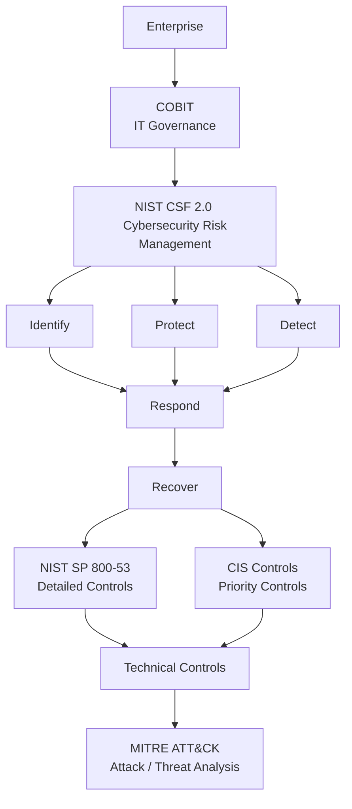

### Framework如何搭配  

---

**先看我們這章的知識地圖**  

---
 
**Framework是「分工」，各自有各自擅長的東西。**  

看一個實際搭配案例  

**第一階段：董事會**  

董事會先問：「IT投資是否符合企業策略？」，例如公司今年的目標是發展數位銀行，這時COBIT協助處理：  
- IT Governance  
- Business Alignment  
- Risk  
- Resources  
- Performance

也就是IT到底有沒有創造Business Value？  

---

**第二階段：CISO**  

接下來CISO問：那整體Cybersecurity Risk要怎麼管理？」，這時可以用NIST CSF 2.0建立  
- Govern  
- Identify  
- Protect  
- Detect  
- Respond  
- Recover

CISO可以透過它「了解企業目前的Cybersecurity狀態。」  

---

**第三階段：找出資安缺口**  

經過NIST CSF評估之後，會發現一些Gap。  

---

**第四階段：選擇Controls**  

例如Detect/Respond不足，那到夜要做什麼？這時NISP SP 800-53可以提供詳細Security/Privacy Controls。  

---

**第五階段：資源有限**  

CISO發現：「全部做太貴了」，所以接著參考CIS Controls，進行Prioritization。  

---

**第六階段：SOC開始工作**  

控制措施部署之後，SOC開始監控，某一天遇到攻擊，SOC可以用MITRE ATT&CK快速Mapping攻擊行為。  

---

Red Team也可以用ATT&CK，可以測試自己的企業能不能偵測到某些攻擊，如果測試後SOC沒發現，那就是Detection Gap(偵測缺口)，要再回到NIST CSF改善。  

而ISO 27001跟NIST CSF又可以互相互補，一個是強調建立、維護與持續改善ISMS，一個是強調Cybersecurity Risk Management的整體架構。  

ISO 27002跟NIST SP 800-53兩邊也可以互相Mapping。  

**所以真正的企業可能是：「ISO 27001 + NIST CSF + CIS Controls + COBIT + MITRE ATT&CK」。**  
