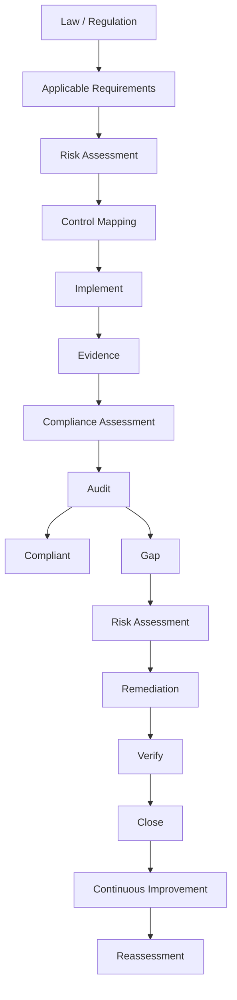

### 台灣法遵實務  

---

**第一步：Identify Requirements**  

找出所有適用的要求。  

---

**第二步：把Requirement轉成Control**  

假設法律要求保護個人資料，我們要進一步問「怎麼保護？」，這就是Control Mapping，就就是把外部要求對應到實際控制措施。  

---

**第三步：Evidence**  

例如要求使用者必須用MFA，Control做出Microsoft Entra ID啟用MFA，這時Evidence可以是MFA Configuration + Users Enrollment Report + Authentication Logs + Policy。  

---

**第四步：Assessment**  

確認到底有沒有符合。  

---

**第五步：Risk Assessment**  

評估這個Gap的風險多大。  

---

**第六步：Remediation**  

發現Admin沒有MFA，那就趕快把它做出來，這就是補救措施。  

---

**第七步：Audit**  
確認要求是否真的被落實。  

---

**第八步：持續改善**  
新的漏洞會出現，法律會修法，供應商會變，要持續關注並改善。  
第三方也要放入Compliance：假設資料放在第三方，也要確認是否有以上的資安措施，也可以跟第三方要Evidence。  

---

**法遵核心圖**  

